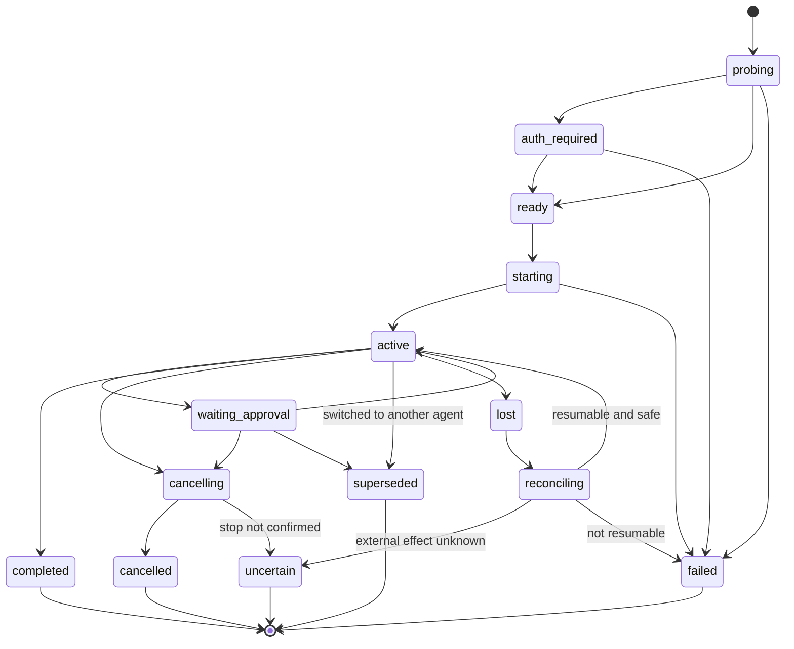

# Agent Runtime and Authentication

## Architectural decision

Charrette is an agent harness in the same sense that a workflow scheduler is a
job harness: it supplies durable intent, policy, lifecycle, recovery, and
evidence around execution. It is not a new foundation-model runtime.

The boundary is:

| Charrette owns | Provider runtime owns |
|---|---|
| Project, task, run, graph, attempts | Model request loop |
| Scheduling and host placement | Context window and provider compaction |
| Workspace preparation and repository grants | Provider-native tools and subagents |
| Policy, approvals, budgets, attention | Native conversation representation |
| Skill resolution and instruction bundle | Provider prompt/session mechanics |
| Normalized observations and retained evidence | Token refresh and provider account protocol |
| Restart reconciliation and repair | Provider-specific retry within one call/session |
| Cross-provider and cross-run record | Provider-native usage/accounting detail |

If Charrette implements both columns, it inherits the hardest and fastest-moving
parts of Codex, Claude Code, and every future provider while weakening the
durable project layer that differentiates it.

Charrette reaches every agent through one protocol, the Agent Client Protocol
(ACP), and adds native channels per agent only where ACP falls short
([ADR-002](../decisions/002-acp-for-every-agent.md)).

## Agents in the MVP

Claude Code, Codex and OpenCode are interchangeable from the first version. A
task's lead, any step and the coordinator can run on any of them, and a task
can move between them.

| Agent | How Charrette runs it | Sign-in, held by the agent | Notes |
|---|---|---|---|
| Claude Code | `claude-agent-acp`, the ACP project's adapter on the Claude Agent SDK. Claude Code has no native ACP | Claude plan or Anthropic API key; status from `claude auth status` | Starts in the user's own default mode, which can be `bypassPermissions`, so Charrette turns bypass off and adds ask rules for every session. The Agent SDK reports usage limits, but the adapter doesn't forward them |
| Codex | `codex-acp`, the ACP project's adapter, driving its own bundled Codex | ChatGPT plan or OpenAI API key; status from `codex login status` | Charrette uses its `workspace-write` mode, not the default `agent` mode, whose automatic reviewer answers requests itself. Usage limits reach the adapter but are only rendered as `/status` text |
| OpenCode | `opencode acp`, native | API keys for any provider; local model servers; status from `opencode auth list` | The bring-your-own-key route. It cannot use a Claude plan. It allows most actions without asking unless configured, so Charrette starts it with inline config that makes it ask |

What each agent reports was read from the agents themselves on 28 September
2026, with `scripts/probe.ts` in `@charrette/provider-adapters`: claude-agent-acp
0.84.0, codex-acp 2.0.0 and OpenCode 1.18.31. All three expose their mode and
model as session config options and can change both within a session; all
three can load and resume sessions. Claude Code and Codex also advertise
steering a turn in progress, as an extension in `_meta`. Probe again after
upgrading any of them.

Charrette checks sign-in with each agent's documented status command, never by
reading a credential store, and tells the user the agent's own login command
when it is signed out. The Claude Code desktop app and the `claude` command
line sign in separately; the adapter uses the command line's sign-in.

An agent can have several sign-ins. Each is an account with its own folder,
and the agent's usual folder is the first
([ADR-012](../decisions/012-several-accounts-per-agent.md); Several accounts,
below).

Another ACP agent, such as Gemini CLI, is added by a registry entry and the
contract suite, not new code.

## Adapter contract

The domain depends on the adapter's own interface, in
`@charrette/provider-adapters`, not directly on a vendor SDK, CLI schema, or
ACP revision. No ACP type appears in it, so a native adapter for one agent
(Tier B below) can stand in without callers changing. It is written with Effect
([ADR-009](../decisions/009-effect-on-the-runtime-side.md)).

```ts
connect(options: {
  transport: Transport // a process Charrette owns, or an in-process agent in tests
  onPermission: (request: PermissionRequest) => Effect<PermissionDecision> // from the project's rules
  permissions?: PermissionMeanings // what the agent's option ids mean: the registry's
  onQuestion?: (question: Question) => Effect<QuestionAnswer> // for the person
}): Effect<AgentConnection, AgentStartFailed | AgentExited | AgentRequestFailed, Scope>

interface AgentConnection {
  info: AgentInfo // name, version, protocol, loadSession, closeSession, steering, MCP transports, auth methods
  process?: ProcessInfo // pid, OS start time, environment digest, how stopping went
  closed: Effect<ProcessExit>
  newSession(options: NewSessionOptions): Effect<AgentSession, Failure | OptionUnavailable, Scope>
}

interface AgentSession {
  sessionId: string
  options: Effect<ConfigOption[]> // as last reported: mode, model, effort
  mode: Effect<string>
  prompt(text: string): Stream<SessionEvent, Failure | TurnInProgress> // one turn, ending with TurnEnded
  events: Stream<SessionEvent> // what the agent says between turns
  cancel: Effect<void, Failure>
  interrupt: Effect<void, Failure> // cancel, and wait for the turn to end
  setOption(configId: string, value: string): Effect<ConfigOption[], Failure | OptionUnavailable>
}
```

A scope owns each connection and session: closing it closes the session with
the agent (`session/close`, where offered) and stops the process group.

What it guarantees:

- **The mode is set, and checked.** `newSession` requires a mode, sets it
  before anything else, and refuses the session if the agent doesn't end up in
  it. An agent with no modes can't be made to ask, so it gets no session.
- **One turn at a time.** A prompt while a turn runs fails with
  `TurnInProgress`. A turn reads to its own end even when its stream is
  stopped early, so nothing it says reaches the next turn.
- **Order.** Updates, permission answers and the end of each prompt pass
  through one inbox per session in the order they arrived, so an answer never
  overtakes the tool call it answers, and a turn's last update never follows
  its end.
- **Permissions** are answered as in Permission routing below, and every
  answer is an event: `PermissionAnswered` with the option sent and how far it
  reaches, or `PermissionWithdrawn` when the turn was cancelled first.
- **Failures** are classified (see Usage limits). An agent's structured
  failure report is an `AgentFailure` event, and a turn it ended carries it on
  `TurnEnded`.
- **Questions** the agent asks the person (ACP elicitation, such as Claude's
  AskUserQuestion) go to `onQuestion`, or are cancelled.
- **Nothing is dropped.** An update this version doesn't know is an `Other`
  event with its raw payload.

Not built yet: loading a session, account status side channels, and steering.

The adapter reports, rather than fakes, capabilities:

- structured events and their schema version;
- session/conversation resumption;
- streaming;
- tool-approval hooks;
- file and image attachments;
- model and reasoning selection, and whether it can change within a session;
- usage/cost reporting;
- account usage limits and reset times;
- cancellation and hard termination;
- live steering, queued input, and interruption acknowledgement;
- native subagents or handoffs;
- MCP configuration;
- skill/instruction injection;
- read-only and ask-first session modes;
- sandbox or execution-location claims;
- supported authentication modes.

Unsupported capabilities are explicit. Provider independence means capability
negotiation plus isolated translation, not erasing differences into an
unreliable lowest common denominator.

## Transports

ACP is the default transport. An adapter is one ACP session transport plus
zero or more native side channels for what ACP doesn't carry. The domain sees
the adapter's capability report, never which channel supplied a fact, so a
native adapter can replace ACP for one agent without the domain changing.

| Tier | Mechanism | Policy |
|---|---|---|
| A | ACP, spoken natively or through a maintained adapter | The default for every agent. Pin agent and adapter versions |
| B | A native structured protocol or SDK, such as Codex app-server or OpenCode's server | A side channel for what ACP lacks, or a full adapter for one agent when ACP falls short |
| C | Documented headless CLI with structured JSON/events | Supported with stricter lifecycle and compatibility tests |
| D | PTY/TUI scraping, undocumented local protocols, or another agent's private session files | Experimental only; never the default correctness path |

Charrette must never parse ANSI terminal presentation as its canonical event
stream. A terminal may be exposed as a user surface, but execution truth comes
from a documented structured channel or remains explicitly uncertain.

## ACP

ACP is the default because one implementation reaches every agent in the MVP,
and each later agent costs a registry entry rather than an integration. As of
September 2026 it covers:

- initialisation, protocol version and capability negotiation;
- authentication methods;
- creating and cancelling sessions, and loading them where the agent supports
  it;
- prompts and streamed updates: messages, tool calls, plans;
- permission requests, which Charrette answers (see Permission routing);
- session modes and config options, including the model selector
  (`session/set_config_option`);
- the MCP servers a session may use, given at `session/new`;
- context-window use and cost (`usage_update`).

It does not cover:

- usage limits and quotas, which the protocol leaves to a future proposal;
- steering a turn in progress, so interrupt-and-continue is a cancel followed
  by a new prompt ([01](01-concepts-and-project-model.md));
- moving history between agents: a session can only be loaded by the agent
  that created it.

ACP is still not Charrette's domain model:

- ACP is a client-agent transport, not a project, workflow, integration, or
  persistence model.
- Protocol drafts and capability growth must be quarantined inside an adapter.
  The protocol moves quickly; the model selector, for example, moved from an
  unstable method to session config options during 2026.
- Charrette needs durable graph and authority semantics even if every provider
  eventually speaks ACP.

The adapter converts ACP sessions and notifications into Charrette
`ProviderSession` and `Observation` records while retaining the raw protocol
version for diagnostics. ACP session identifiers are never promoted into
`Task` or `Run` IDs.

## The contract suite

Every agent adapter passes the same suite, against the oldest and newest
supported versions of the agent and its adapter:

1. initialisation and capability/version negotiation;
2. login-required and account-switch behaviour;
3. starting and, where supported, loading a session;
4. streaming update ordering;
5. permission request/response round trips;
6. changing the model within a session, or reporting that it can't;
7. cancellation versus process termination;
8. input queued during output and interrupt-and-continue behaviour;
9. crash behaviour during a tool action;
10. usage-limit recognition from errors, and account status where the agent
    has it;
11. unknown or added protocol fields;
12. bounded log retention and redaction;
13. a rejected action lets the turn carry on;
14. a permission request still waiting when the turn is interrupted is
    withdrawn;
15. a repository's own agent settings, allowing everything, don't stop the
    agent asking.

The suite runs against a scripted fake agent in CI and against the real agents
on demand (`bun run test:agents`), in a repository whose own settings allow
everything and start in bypass mode. As of 29 September 2026 all three agents
pass 1, 3 to 7, 11 and 13 to 15; 2, 9 and 10 are covered against the fake
agent only; account switching, loading a session, queued input and 12 are not
built yet.

## Agent registry

Each agent is a registry entry, not a code path:

```ts
type AgentDefinition = {
  id: "claude-code" | "codex" | "opencode"
  source: "bundled" | "user_installed"
  launch: (node: string) => LaunchSpec // command, args, env, which parent variables it inherits
  modes: { ask: string; readOnly: string }
  options: { mode: string; model: string; effort?: string } // config option ids
  signIn: { status: (node: string) => LaunchSpec; read: (output, exitCode) => boolean | undefined; login: string }
  permissions: PermissionMeanings // what its option ids mean
  sessionMeta?: (role?: 'lead' | 'reader') => Record<string, unknown> // `_meta` for session/new: asking, or read-only
  knownGaps: string[]
}
```

- Adapters Charrette ships, `claude-agent-acp` and `codex-acp`, are bundled at
  pinned versions. Nothing is fetched with `npx` or a similar tool at run
  time. Adapters written for Node run on Electron's own Node
  ([02](02-desktop-runtime.md)).
- Agents the user installs, such as OpenCode, are found by probe, and their
  version is checked against the support matrix.
- Adding an ACP agent means adding an entry and passing the contract suite.

## Where agent frameworks fit

The OpenAI Agents SDK, LangGraph, or another agent framework may later execute a
Charrette-authored agent node when Charrette itself owns that node's model/tool
loop.

They do not replace:

- Codex or Claude Code as full coding-agent runtimes;
- the project/repository/workspace model;
- external-system synchronization;
- the durable cross-run record;
- workflow authority and policy.

Use specialists or handoffs only when prompts, tools, or policies genuinely
differ. Spawning agents is not a substitute for decomposing a graph into
durable, observable nodes.

## Briefing agents

Charrette assembles every session's starting context. A new session learns
about the task only from its brief. No session depends on what another agent
remembered ([ADR-005](../decisions/005-charrette-briefs-every-agent.md)).

A brief contains, as the role needs:

- project rules and Charrette's instructions for the role: lead, step, or
  coordinator;
- the task, its plan, and where the graph stands;
- the workspace: base, branch, and the diff so far;
- the conversation record: the user's messages verbatim, earlier agents'
  turns, decisions, what was tried and failed, and open items;
- step results and artifacts the role needs;
- for a later review round, the earlier rounds' findings and how each was
  settled, with the lead's response and any person's decision
  ([05](05-workflow-engine.md));
- per-project instructions for a step type, such as `.charrette/review.md`.

The same brief starts:

- a lead on a new task;
- every step;
- the coordinator's session when it is rebuilt ([04](04-coordinator.md));
- a new attempt after a crash or retry;
- the new agent after a switch.

Rules:

- Charrette does not edit a repository's own instruction files (`CLAUDE.md`,
  `AGENTS.md`). Each agent still reads its own. The brief makes sure every
  agent also starts with the same project context. Since September 2026 Claude
  Code falls back to `AGENTS.md` only when no `CLAUDE.md` exists, so a
  repository with both still gives different agents different instructions.
- What fits goes in the first prompt. The rest stays readable through
  Charrette's tools (an MCP server given to every session at `session/new`), so
  the agent reads it when it needs it.
- The brief sent is recorded as an artifact on the attempt, so what an agent
  was told is always inspectable.
- Project knowledge, when memory is built, enters sessions through the brief.

## Switching model or agent

These are two different operations.

**Model, within one agent.** Changing Sonnet to Opus in Claude Code, or between
Codex models, keeps the session. The adapter sets the model config option
through ACP and the context carries over. The prompt cache is per model, so the
first turn after a switch costs more. An agent whose ACP can't change model per
session restarts with a different configuration and loads its session again
where it can, or the change is handled as an agent switch. None of the MVP's
agents needs this today. Effort is the same: a config option (`thought_level`)
set as a session starts and changed within it.

What each agent offers comes from the agent, in its own ids and names: the
choices of its session's model and effort options. Charrette keeps no table of
models; it reads them from the agent's latest session, and asks an agent it has
never run by starting it once in an empty folder, read-only, and stopping it.

**Agent.** A session can't move between agents. A switch starts a new session
on the new agent, in the same workspace, from a brief. The new session belongs
to a new attempt of the same node; the old session ends as `superseded`, and
its controller is fenced.

In the MVP the new agent takes over everything: the whole conversation record,
the plan, the open items, and the code as it stands. The record goes into the
first prompt as far as it fits, most recent first, and the rest is readable
through Charrette's tools. No model is needed to switch, so a switch is
immediate and works when the outgoing agent is out of usage.

This will be tuned. Candidates include a fresh take that leaves out the
previous agent's reasoning (research in 2026 suggests a stronger model does
better without a weaker model's trajectory), starting again from base rather
than the current code, and a generated handoff in the style of Amp's. Each is a
brief policy; the mechanism stays the same.

Rejected: converting one agent's session files into another agent's format so
its own resume picks them up. Those formats are private and change with each
release (Tier D), and provider-signed reasoning is lost either way.

## Usage limits

A usage limit belongs to an account (`ProviderPrincipal`), so it pauses every
session on that account at once ([05](05-workflow-engine.md)). The agent's
other accounts are not out, and moving on tries them first (Several
accounts, below). ACP does not report limits. Charrette detects them in two
layers:

1. **From errors, on every agent.** Each adapter classifies a failed turn as
   `usage_limit`, with the reset time when the error carries one. Claude's
   adapter also reports failures in structured form when the client asks (the
   JetBrains AIR `sessionFailure` extension, in `_meta`): its category and the
   actions it suggests tell an exhausted quota from a short rate limit and a
   full context, where the text alone can't. Every failure is one of
   `usage_limit`, `context_full` (start a new session from a brief),
   `transient` (a short rate limit or an overloaded service: retry after a
   pause), `auth_required`, `invalid_request` or `unknown`.
2. **From account status, where the agent exposes it.** A native side channel
   reports use per window and reset times before the limit is reached:
   - Claude Code: the Agent SDK's `rate_limit_event` gives status, use per
     window (five-hour, seven-day, per model) and reset times.
     `claude-agent-acp` doesn't forward it, so Charrette ships the adapter
     with a patch that forwards it as an ACP extension notification, and
     offers the patch upstream.
   - Codex: app-server's `account/rateLimits/read` and
     `account/rateLimits/updated`, through a small app-server connection used
     only for this.
   - OpenCode: the provider's rate-limit errors and retry hints. API keys have
     no plan windows.

```ts
type AccountStatus = {
  principalId: string
  state: "ok" | "warning" | "limited"
  windows: Array<{ kind: string; usedFraction?: number; resetsAt?: string }>
  source: "error" | "side_channel"
  observedAt: string
}
```

With account status, the scheduler can hold or move work before the limit is
reached rather than after.

## Provider session lifecycle



The same lifecycle is data in `@charrette/domain` (`lifecycles.ts`), whose tests
keep it whole: every state reachable, and none left after a terminal one.

A provider session state does not directly set the run outcome. The workflow
node interprets normalized observations under its retry, verification, and
external-effect policy.

Every provider controller writes with the run attempt's
`controllerGeneration`. A stale controller may contribute attributable
diagnostic observations, but it cannot advance canonical state.

## Process ownership

For every child process, persist:

- executable identity and resolved version;
- adapter and protocol version;
- parent/child ownership identity;
- process-group/job-object strategy;
- start time and host identity;
- provider session ID if obtained;
- last observed event sequence;
- redacted launch arguments and environment allowlist digest;
- controller generation.

Cancellation is layered:

1. send provider-native cancellation;
2. wait a bounded grace period;
3. terminate the owned process group/job object;
4. verify liveness;
5. mark survivors and unknown effects explicitly.

Never kill by executable name or an unverified reused PID.

## Authentication model

Authentication is modeled with three concepts:

```ts
type ProviderPrincipal = {
  id: string
  provider: string
  subjectHint: string
  authMode: "vendor_cli" | "api_key" | "oauth" | "enterprise" | "workload"
  hostScope: string
  observedAt: string
}

type CredentialRef = {
  id: string
  owner: "vendor_cli" | "os_keychain" | "cloud_secret_store"
  locator: string
  exportable: false
}

type ExecutionGrant = {
  id: string
  principalId: string
  provider: string
  allowedHostId: string
  allowedProjectIds: string[]
  allowedOperations: string[]
  expiresAt?: string
  policyRevision: number
}
```

`ProviderPrincipal` records who Charrette believes the provider session
represents. `CredentialRef` points to the supported custodian; it is not a copy
of the credential. `ExecutionGrant` is Charrette policy authorizing use of that
principal for a bounded purpose.

### Vendor CLI and subscription login policy

Some providers offer a useful local CLI authenticated through a consumer or
team subscription but no supported API equivalent. Presence of that CLI is a
capability, not permission to extract or relay its session.

Rules:

1. The official CLI owns login, refresh, logout, and credential storage.
2. Charrette may invoke documented status/login commands or react to a
   structured `auth_required` response.
3. Charrette never reads, scrapes, copies, decrypts, exports, uploads, or
   synchronizes the CLI's credential cache.
4. It never asks for a provider password or browser session cookie.
5. Subscription-backed execution runs on the user's device and only where the
   provider's current documentation and terms permit that use.
6. Charrette cloud stores the fact that a device reports a capability, not the
   underlying subscription token.
7. Remote or hosted execution requires a provider-approved API key, OAuth
   grant, workload identity, service credential, or enterprise access token.
8. If no supported remote credential exists, the correct architecture is a
   local runner—not credential emulation.
9. Account switching is explicit and recorded. A run snapshots the observed
   principal and aborts or seeks approval if it changes. Charrette's own
   moves between accounts are recorded as switches. A swap made by another
   tool shows up in the next sign-in check, and is recorded then.
10. Logging redacts tokens, authorization headers, cookies, device codes, and
    provider-defined secret fields before persistence.

This is both safer and more durable than coupling Charrette to the current shape
of a vendor's private auth cache.

### Several accounts

An agent can have several sign-ins on one Mac: a work and a personal plan,
a plan per client, several OpenCode logins
([ADR-012](../decisions/012-several-accounts-per-agent.md)). Each is an
**account**: one sign-in, kept by the agent in a folder of its own, its
**home**. Charrette only points the agent at the folder, and the rules above
still hold: it never reads, copies or moves what the agent keeps there.

```ts
type AgentAccount = {
  id: string
  agentId: string
  deviceId: string
  name: string               // the person's own: "work", "client A"
  home: string | null        // null: the agent's usual folder, its first account
  order: number              // the person's order; the first allowed one is used first
  principalId?: string       // who the agent last said it is signed in as
  paidBy?: "plan" | "key"    // from the agent's status command
  adoptedFrom?: string       // the tool that made the home, when Charrette didn't
}
```

What makes a home, per agent:

| Agent | The home | Its sign-in | What else it holds |
|---|---|---|---|
| Claude Code | `CLAUDE_CONFIG_DIR` | On macOS, a Keychain item named after the folder's path (`Claude Code-credentials-` and a hash of it), so a home can't move | Settings, `CLAUDE.md`, agents, commands, plugins, history |
| Codex | `CODEX_HOME` | `auth.json` in the home, or the Keychain where it is set to use it | `config.toml`, `AGENTS.md`, skills, history |
| OpenCode | `XDG_DATA_HOME`, with OpenCode's data under `opencode/` | `auth.json`, one entry per provider | Its database and history. Its config is under `XDG_CONFIG_HOME`, which stays the person's |

**Adding an account.**
- Charrette makes a home under its own data folder, named by the account's
  id, so it never moves.
- It opens the agent's own sign-in there, in a terminal, for the person:
  `claude auth login`, `codex login`, `opencode auth login`, each with the
  home in its environment.
- The person's usual settings, instructions and skills are linked into the
  home; the sign-in and the agent's own history are the home's own.
- The status command, run with the home, says who the account is and
  whether a plan or a key pays for it.

**Adopting a home another tool made.** Charrette offers the folders of
known switchers, and the person can add any folder by hand. It reads the
folders' names, never what is inside, and leaves them as the tool made them.

| Kind of switcher | Examples | What Charrette does |
|---|---|---|
| A home per account | `codex-profiles`; codex-account-switcher (JoRo-Code); codex-accounts (omarhoumz), isolated homes; ccam's and the other `~/.claude-*` profile folders; claude-multi-account | Adopts each folder as an account |
| One live sign-in, swapped by copying a saved one over it | opencode-swap; opcode-switch; the OpenCode profile switcher script; opencode-openai-sub-switcher; opencode-switcher (Copilot); cx-switch; codex-accounts (marivaldojr); ccam's `claude-switch` | Runs whichever account is active, as the agent's first account. It never swaps, because a swap changes the account under every running session, and a login kept in two places breaks when one copy refreshes. Each saved account the person wants in parallel is added once, with a sign-in of its own |
| Rotation inside the agent or in front of it | oc-codex-multi-auth and opencode-antigravity-multi-auth (OpenCode plugins); codex-multi-auth; codex-account-gateway; claude-code-multi-account | Works unchanged. Charrette sees one account, and its usage limit means the whole pool is out |

The switchers' folders and commands are read from each one when its
support is built, and checked again by the contract suite.

**Which account runs.**
- Every account can run work. A project's rules can limit each agent to some
  of its accounts, which is an `ExecutionGrant`'s `allowedProjectIds`.
- A conversation stays on the account it runs on, for its session and its
  prompt cache.
- A new session takes the first account, in the person's order, that is
  allowed for the project, signed in, and not out of usage.
- The account is not picked per message. Pinning a conversation to one
  account can come later.

**Out of usage.**
- A limit puts one account out, not the agent. The side channels above
  report per session, so what they report goes to that session's account.
- Under the project's "move on" rule, work first goes to the same agent's
  next allowed account, on the same model. A home is separate, so the new
  account starts a session from a brief, as at any switch (Switching model
  or agent).
- Only then does the work go to the next agent, and only on an account a plan
  pays for: another agent never spends the person's money unasked. The
  agent's own accounts take work over whatever pays for them, since the
  person added each one.
- The thread names the accounts, for example "Codex (personal) is out until
  14:00; Codex (work) took over".

**Environment.** A home's variable reaches every program the session runs,
not only the agent. `XDG_DATA_HOME` is the one that matters, since other
programs read it too.

### Claude plans in third-party apps

Anthropic's rules for using a Claude plan through other apps changed three
times in 2026. Third-party use was blocked on 4 April. A separate, smaller
credit was then announced for 15 June, and paused on 15 June. As of 28
September 2026, Agent SDK and third-party app usage draws on the plan's normal
limits, and Anthropic says it will give notice before changing that.

Charrette running Claude Code through `claude-agent-acp` counts as third-party
use. Check the policy again before relying on a Claude plan beyond the proof of
concept; an Anthropic API key, through Claude Code or OpenCode, is the fallback.
Plan sign-in works only in Claude Code and claude.ai, so OpenCode cannot use a
Claude plan.

### API keys and OAuth

When a provider supports programmatic credentials:

- use the OS keychain locally;
- store only a keychain locator in SQLite;
- scope environment injection to the single owned child;
- never forward the entire parent environment;
- redact command lines and diagnostics;
- support revocation and key rotation;
- require cloud-side secret storage for cloud runners;
- show which principal, billing context, and host will be used before execution.

Keys the user gives Charrette for OpenCode follow these rules: they are kept in
the Keychain and injected only into that OpenCode child's environment. Keys
OpenCode already holds stay with OpenCode.

Device authorization and OAuth callbacks must use the provider's documented
native-app flow. A local loopback callback or claimed HTTPS scheme requires
state/PKCE validation and exact redirect handling.

## Capability and support matrix

Each released adapter declares:

- minimum/maximum tested runtime versions;
- protocol/schema versions;
- operating systems and architectures;
- authentication modes;
- supported and degraded features;
- known unsafe or blocked versions;
- last compatibility-test date.

At launch:

1. resolve the executable without trusting repository-local PATH shadowing;
2. inspect version and signature/provenance where practical;
3. perform a cheap capability handshake;
4. compare against the matrix;
5. choose supported, degraded, or blocked behavior;
6. persist the actual result with the run.

Automatic provider upgrades must not silently change an in-flight run's
adapter semantics. An app update can add support, but active sessions stay tied
to the adapter/protocol version with which they began.

## Permission routing

Charrette must see every permission request to apply the project's rules,
including the always-ask list
([ADR-007](../decisions/007-permission-requests-reach-charrette.md)).

- Every session starts in a mode where the agent asks rather than acts. No
  session starts in a bypass mode. Requests arrive as ACP
  `session/request_permission`. The session records how it was started: the
  mode, and the MCP servers and tools its role was given.
- Charrette decides allow or reject, and the adapter sends the narrowest
  option that carries the decision out. It never sends an "always" option: the
  agent could remember the rule itself, and later requests would stop reaching
  Charrette. A standing allow is Charrette's own rule, recorded with the
  decision, and applied by Charrette.
  - Allow: the option for this action; where the agent offers nothing
    narrower, the one for the rest of the turn (Codex's permission profiles),
    recorded with scope `turn`.
  - Reject: the option that skips the action and lets the agent carry on.
    Where the only rejection stops the turn (Codex's file edits), the adapter
    resumes the turn itself, telling the agent what was not allowed and why,
    up to three times.
  - Agents give the same ACP kind to options that do different things (Codex
    has two `reject_once` options, one of which stops the turn), so the
    registry names what each agent's option ids mean.
  - A decision that fails to be made is a rejection.
- Cancelling a turn answers the requests still waiting with `cancelled`, as
  ACP asks of the client, whether or not the agent withdraws them.
- Charrette answers from the project rules. Nearly everything is allowed
  without the user; only what the rules keep for the user becomes an attention
  request. Every answer is recorded on the task, and the thread shows allowed
  requests as one quiet line.
- A session with a read-only role, such as the coordinator or a review step,
  starts in the agent's read-only mode where it has one (for example Claude
  Code's plan mode, Codex's read-only sandbox, or OpenCode's plan agent), and
  the rules deny it writes as well.

What keeps each agent asking, whatever its own settings say:

| Agent | How | Checked against |
|---|---|---|
| Claude Code | Every session gets ask rules for Bash, Edit, Write, MultiEdit, NotebookEdit and WebFetch, has bypass mode turned off for its whole life, loads only the MCP servers Charrette gives it (`strictMcpConfig`), and runs its shell in Claude's sandbox, all through the adapter's `_meta.claudeCode.options`. Ask rules win over allow rules from any settings file, and over a hook that approves | A repository whose `.claude/settings.json` allows those tools, defaults to `bypassPermissions`, and has a hook that approves every tool call |
| Codex | Mode `workspace-write`, whose reviewer is the person. The default `agent` mode sends requests to an automatic reviewer instead, and was seen to write outside the workspace without asking | Writing outside the workspace, which it asks for |
| OpenCode | Inline config (`OPENCODE_CONFIG_CONTENT`) that sets edits, commands and fetches to ask, for its built-in agents too, and lets it carry on after a rejection (`experimental.continue_loop_on_deny`) | A repository whose `opencode.json` allows everything |

**Sandboxes are the boundary for commands.** A permission request for a shell
command carries only its text, and no rule can tell what a script will write.
So where an agent has a sandbox, it keeps commands inside the worktree:

- Codex's, in `workspace-write`, with the network off.
- Claude Code's, switched on for every session. A command that stays inside
  runs without asking. One that needs the network asks per host. A write
  outside is blocked, and Claude reports it instead of retrying outside the
  sandbox unless asked to.
- OpenCode has none yet. Wrapping it in the same sandbox-runtime Claude uses
  is next.

A command that has to leave its sandbox reaches Charrette as a request, and
the rules read it as a shell would, into commands and words. They ask about:

- pushes to the default branch, force pushes, pushes of every branch or of
  tags, and deleting a branch other than the task's;
- merges, and deploy and publish commands;
- git pointed at another repository;
- a write whose words name a place outside the worktree, following symlinks.

Where they can't tell where a push goes or where an edit writes, they ask.

**Git in a worktree.** A worktree's git data lives in the main repository,
outside the worktree. Inside Codex's sandbox, each `git add` and `git commit`
therefore asks, and the rules allow git's own writes for the task, so the
person isn't involved. Claude's sandbox already lets a worktree write the main
`.git`, except its hooks and config. Making the whole `.git` writable for
Codex was rejected: it would expose hooks, config and every other branch.

Known gaps:

- A repository's hooks (`.claude/settings.json`, `.codex/hooks.json`) and
  Codex project config run as code on the Mac. Claude's SDK loads them without
  the trust prompt its app shows, and codex-acp marks every session folder
  trusted. Opening a project should be the trust step (see the open questions).
- Claude's sandbox denies writes to a repository's tracked `.claude/` files, so
  git can fail to check those out inside it
  ([claude-code#93173](https://github.com/anthropics/claude-code/issues/93173)).
- Reads and fetches outside the worktree are allowed; see the open questions.
- If ask rules ever stop winning, the fallback is to leave the project and
  local setting sources out of Claude sessions. In the Agent SDK that also
  stops the repository's `CLAUDE.md` loading.

## Approval boundary

Provider-native permission prompts are inputs to Charrette policy, not a
replacement for it.

An `ApprovalRequest` records:

- normalized action and parameters;
- action digest;
- affected repositories, paths, tools, external systems, and credentials;
- relevant diff/artifact/input hashes;
- provider session and workflow node;
- policy revision and reason;
- expiry and one-time/multi-use behavior.

The `Decision` records actor, outcome, reasoning, time, and consumption. If an
input or action changes, the digest changes and the decision no longer applies.

Examples requiring Charrette-level handling include:

- destructive Git operations;
- external messages, issue transitions, deployments, or merges;
- using a new repository binding or MCP server;
- introducing a skill script;
- increasing budget or loop bounds;
- graph patches that expand authority.

## Repository and prompt trust

Repositories, issue bodies, tool output, MCP responses, provider messages, and
skills are all untrusted input.

Controls:

- do not place provider credentials in a repository workspace;
- do not let repository content alter the runtime's adapter configuration
  without a reviewed project policy path;
- delimit source-derived instructions and record their origin;
- constrain Charrette-owned filesystem operations to registered roots;
- allowlist child environment variables;
- require explicit grants for MCP tools and external mutations;
- record the exact brief, skills, and instructions sent to the agent;
- treat provider claims about completed actions as observations until verified.

Host-native execution uses the current user's OS authority and must be labeled
**trusted-host execution**, not “sandboxed”. Container or remote sandbox support
is a separate `ExecutionHostAdapter` with its own capabilities.

## Failure semantics

The adapter classifies failures without collapsing them:

| Class | Example | Default response |
|---|---|---|
| `auth_required` | Logged out or expired grant | Pause and request authentication |
| `unsupported_version` | CLI schema outside support matrix | Block or degraded mode; never guess |
| `transient_provider` | Short rate limit or temporary network failure | Bounded retry with jitter and provider hint |
| `usage_limit` | The account's allowance is used up until a reset | Pause every session on that account; move or hold work under the project rule |
| `invalid_request` | Unsupported model/tool option | Fail node with actionable detail |
| `provider_refusal` | Policy refusal | Record terminal provider outcome |
| `process_lost` | Child vanished | Reconcile session and external effects |
| `cancel_uncertain` | Kill issued but effect unknown | Attention/verification before retry |
| `protocol_violation` | Malformed or impossible event sequence | Quarantine adapter/session and retain redacted diagnostics |

The UI displays the consequence and recovery options, not raw stack traces or a
single generic “agent failed” label.

## Verification gates

- No test obtains a provider token by reading a vendor credential cache.
- Logging and diagnostic export contain no seeded secret canary.
- Supported CLI versions pass the same contract suite.
- Unknown event fields do not crash the adapter; impossible transitions do.
- Provider restart and Charrette restart are tested at every lifecycle boundary.
- Provider-native steering, where present, preserves Charrette's durable input
  order; where absent, cancellation plus resume/new turn preserves the same
  interrupt-and-continue semantics.
- A stale controller cannot advance state after replacement.
- Cancellation kills the complete owned process tree on every target OS.
- An account switch invalidates the prior execution grant.
- A provider without resume support cannot be presented as resumed.
- Host-native execution is never labeled sandboxed.
- Claude Code, Codex, and OpenCode pass the same contract suite.
- No session starts in a bypass mode; every permission request reaches
  Charrette.
- Switching to another agent keeps the workspace and hands over the whole
  record, and the superseded session cannot write afterwards.
- A usage limit is recognised on every agent from its error, and before it is
  reached on agents with account status.
- Every session's brief is recorded.

## References

- [Agent Client Protocol](https://agentclientprotocol.com/)
- [ACP session config options](https://agentclientprotocol.com/protocol/session-config-options)
- [ACP session usage RFD](https://agentclientprotocol.com/rfds/session-usage)
- [claude-agent-acp](https://github.com/agentclientprotocol/claude-agent-acp)
- [codex-acp](https://github.com/agentclientprotocol/codex-acp)
- [OpenCode ACP support](https://opencode.ai/docs/acp/)
- [Codex app-server](https://learn.chatgpt.com/docs/app-server)
- [Codex authentication](https://learn.chatgpt.com/docs/auth)
- [Use the Claude Agent SDK with your Claude plan](https://support.claude.com/en/articles/15036540-use-the-claude-agent-sdk-with-your-claude-plan)
- [Amp: Handoff](https://ampcode.com/news/handoff)
- [The Handoff Tax (arXiv 2608.24358)](https://arxiv.org/abs/2608.24358)
- [OpenAI Agents SDK orchestration](https://developers.openai.com/api/docs/guides/agents/orchestration)
- [OAuth 2.0 for native apps, RFC 8252](https://www.rfc-editor.org/rfc/rfc8252.html)
