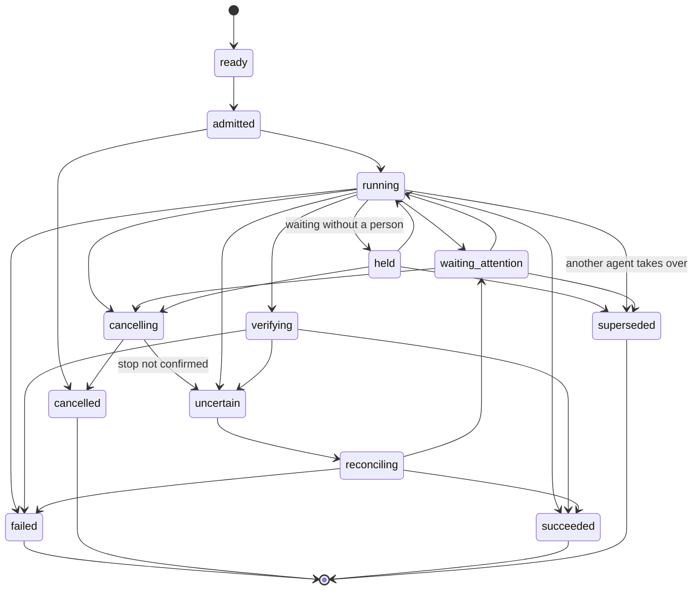

# Workflow Engine

## Decision

Charrette needs workflow semantics, but it does not need a general-purpose
workflow product in the MVP.

Build a small durable graph kernel around the workflows Charrette actually
ships. Borrow determinism, retries, checkpointing, compensation, and versioning
ideas from mature systems. Do not begin with a visual builder, arbitrary agent
code, or unrestricted self-modifying graphs.

The core rule is:

> A workflow definition is immutable. A run materializes a revisioned execution
> graph. Agents may propose bounded graph patches, but only Charrette validates
> and commits a new graph revision.

This permits dynamic work without allowing a model to rewrite history or evade
policy.

## Definitions

| Concept | Meaning |
|---|---|
| `WorkflowDefinition` | Named logical workflow and ownership metadata |
| `WorkflowVersion` | Immutable graph template, schemas, policy requirements, and content hash |
| `WorkflowExecution` | One run's materialized workflow version and current graph revision |
| `ExecutionGraphRevision` | Immutable snapshot of nodes, edges, resolved parameters, and bounds |
| `Node` | Durable unit of orchestration with typed input/output contract |
| `NodeAttempt` | One scheduled try of one node under one controller generation |
| `GraphPatchProposal` | Typed proposed change against an expected graph revision |
| `CompensationPlan` | Explicit action for reducing or reversing a confirmed external effect |

Definitions and executions are different. Editing a definition never mutates an
active execution or historical run.

## Node types

Keep the executable vocabulary small:

1. **Deterministic action** — Charrette-owned pure or idempotent control-plane
   work.
2. **Agent** — provider session/turn with an instruction, skill snapshot,
   capability grant, budget, and output schema.
3. **Integration** — one typed connector operation with idempotency and
   reconciliation policy.
4. **Human decision** — opens an attention request and resumes with a typed
   answer.
5. **Condition** — deterministic routing over committed data.
6. **Bounded map/fan-out** — materializes child work from a finite input set
   under a cardinality and concurrency limit.
7. **Join** — waits under an explicit all/any/quorum/allow-partial policy.
8. **Verification** — checks a claimed outcome independently.
9. **Compensation** — reduces or reverses an earlier confirmed effect.
10. **Subworkflow** — invokes a pinned workflow version with mapped inputs.
11. **Bounded loop** — repeats a declared subgraph under iteration, time, cost,
    and exit-condition limits.

Arbitrary shell is not a graph-control primitive. A command may execute inside
a constrained action/verification node with explicit workspace, environment,
timeout, output, and approval policy.

## Typed inputs and outputs

Node inputs are immutable references or small values:

- prior node output schema/version;
- artifact ID and content hash;
- repository binding/workspace reference;
- external-resource binding and observed revision;
- decision ID;
- skill-resolution snapshot;
- policy/budget reference.

Large output is stored as an artifact; the node output contains the reference
and digest. A downstream node never depends on a mutable “latest output” path.

Schemas are versioned. A workflow upgrade that changes a schema must supply an
explicit adapter for existing data or start a new execution.

## Graph validation

Before materialization, validate:

- unique node and edge IDs;
- reachable terminal path;
- input/output type compatibility;
- no undeclared cycle;
- bounded loop iteration/time/cost;
- fan-out cardinality and concurrency limits;
- join behavior for failed, skipped, and cancelled branches;
- available provider, integration, skill, and host capabilities;
- required repository bindings and access modes;
- authority and approval requirements;
- cancellation and compensation behavior;
- definition content hash and supported schema version.

A graph may be acyclic except for the explicit `BoundedLoop` construct. Hidden
cycles assembled from conditional edges are rejected.

## Materialization and scheduling

At run admission:

1. resolve a `WorkflowVersion`;
2. snapshot task/repository requirements;
3. resolve skill and capability dependencies;
4. evaluate policy and budget;
5. materialize `ExecutionGraphRevision 1`;
6. persist it before scheduling;
7. enqueue ready nodes transactionally;
8. assign one controller generation to the run attempt.

A node is ready only when:

- all required predecessors meet its join policy;
- inputs are committed and schemas valid;
- its execution host can satisfy repositories, tools, credentials, and runtime;
- concurrency and budget capacity is available;
- no cancellation or unresolved attention gate blocks it.

Scheduler admission and node execution are separate. A process starting is an
observation after admission, not proof that the node succeeded.

## Node attempt lifecycle



The same lifecycle is data in `@charrette/domain` (`lifecycles.ts`). An
attempt ends as `superseded` when a switch hands the node to another agent;
a new attempt of the same node takes over. An attempt is `held`, with a reason,
when it waits without needing a person, such as for a usage limit to reset;
`waiting_attention` is only for a person.

A retry creates a new `NodeAttempt`. It never erases the failed attempt.

Failure policy is node-specific:

- maximum attempts;
- retryable error classes;
- delay/backoff/jitter;
- timeout and heartbeat;
- whether the operation is idempotent;
- how to reconcile an unknown effect;
- fallback provider/tool;
- verification and compensation requirements.

## Dynamic graph evolution

Dynamic work is necessary: an agent may discover another repository, a new
verification requirement, a dependency, or a need to split work. The unsafe
implementation is to let it directly edit the live graph.

Instead the agent emits a typed `GraphPatchProposal`:

```ts
type GraphPatchProposal = {
  id: string
  executionId: string
  expectedGraphRevision: number
  rationaleArtifactId: string
  operations: Array<
    | { kind: "add_node"; node: ProposedNode }
    | { kind: "add_edge"; edge: ProposedEdge }
    | { kind: "skip_node"; nodeId: string; reason: string }
    | { kind: "replace_pending_node"; nodeId: string; node: ProposedNode }
    | { kind: "expand_bounded_map"; nodeId: string; items: ArtifactRef[] }
  >
  requestedAuthorityDelta: AuthorityDelta
  requestedBudgetDelta: BudgetDelta
}
```

Validation rules:

1. The expected graph revision must still be current.
2. Completed, running, and externally-effectful nodes are immutable.
3. A pending node may be replaced only with compatible downstream outputs or
   an explicit downstream migration.
4. Added nodes must use registered node types and valid schemas.
5. Every new loop and fan-out remains bounded.
6. New repositories, tools, credentials, networks, integrations, visibility, or
   external mutations are authority expansions and re-enter policy/approval.
7. Budget expansion is explicit.
8. New graph topology must retain a reachable terminal path.
9. The patch and validation result are durable artifacts.
10. Acceptance creates a complete `ExecutionGraphRevision N+1`; rejection
    leaves revision N unchanged.

Natural-language replanning can generate a proposal, not bypass this path.

## Self-repair

“Self-healing” is only credible when the repair authority is narrower than the
failure domain.

Use this repair ladder:

1. **Transient retry** — same node contract, same authority, bounded attempts.
2. **Session continuation** — resume the provider session if supported and
   safe.
3. **Repair node** — diagnose/repair known local state, then rerun verification.
4. **Equivalent substitution** — use a pre-approved provider, tool, or
   implementation with the same contract and no authority expansion.
5. **Bounded graph patch** — add or replace pending work through validation.
6. **Compensation** — address a confirmed partial external effect.
7. **Human attention** — present evidence, uncertainty, options, and their
   consequences.

Repair has its own attempt count, elapsed time, and cost budget. Failure of a
repair node does not recursively create unbounded repair agents.

### Unknown external effect

The hardest case is not a known failure; it is a lost response after an
external mutation may have succeeded.

The node becomes `uncertain`. Before retry:

1. use provider request/idempotency identifiers;
2. query current external state;
3. compare expected pre/postconditions;
4. store the reconciliation evidence;
5. confirm success, safely retry, compensate, or ask a human.

Never automatically repeat a non-idempotent deploy, message, merge, payment,
issue transition, or destructive Git action merely because the client timed
out.

## Compensation

Compensation is not rollback.

- A published comment may be edited or followed up, but history may remain.
- A merged PR may require a revert, not an “unmerge”.
- A deployed version may be rolled forward or back under a new deployment.
- A created branch may be deleted only if ownership and head digest still
  match.

Each integration node declares whether compensation exists, what authority it
requires, and which confirmation proves it applies. Compensation attempts are
first-class history.

## Workflow upgrades

Workflow versions are immutable.

- New runs select the latest allowed version by project policy.
- Active runs stay pinned to their materialized version and graph revision.
- Security policy may block new scheduling on a vulnerable version without
  rewriting completed history.
- Migrating an active execution is an explicit command at a declared safe
  checkpoint.
- A migration records source/target versions, state mapping, validation,
  decision, and rollback limitations.
- Deleting a definition hides it from new selection but retains all referenced
  versions.

Provider, connector, MCP, and skill versions are independently snapshotted.
“Workflow v4” alone is insufficient for reproducibility.

## Chat input, steering, and interruption

User input is an external event to the active workflow, not an unstructured
side channel.

An agent node may accept steering if its contract declares it. The durable
thread queue determines ordering even when a provider offers native live
steering.

For `interrupt_and_continue`:

1. persist the input and `InterruptRequested` event;
2. acknowledge acceptance to the client;
3. request provider-native interruption or stop at the next safe boundary;
4. fence further writes from the interrupted turn if replacement is required;
5. record partial outputs and possible external effects;
6. materialize the next delivery with the original unfinished obligations plus
   the interrupting message;
7. continue the same task/run unless the user explicitly cancels or supersedes
   it.

This is not failure-retry: the user intentionally changed information or
priority. It is also not cancellation: prior work remains part of the workflow.

If input affects a pending graph node, the controller may create a
`GraphPatchProposal`. It cannot mutate completed nodes or hide already-exercised
authority.

## Task lead, steps, and the task thread

Decided in conversation on 2026-09-26; revisit once the harness runs real
workflows.

**The lead is the implementer.** Each task has one lead: the main execution
agent, chosen per task, and the one the user talks to. It triages, plans, and
implements in its own agent nodes. There is no separate manager agent between
the coordinator and the work.

**Other agents run as steps.** Review, security audit, and similar nodes run
other agents, which may be other models. A step is Charrette's, not the lead's:
it is a node in the execution graph. An agent's own sub-agents (ACP child
sessions) stay inside that agent's node and are not graph nodes.

**Steps report back; they do not write into the task thread.** The task thread
is the conversation between the user and the lead. A step appears there as one
line: started, running, then its typed result. Only three things from a step
break into the thread:

- an attention request (permission or question), labelled with its step;
- a failure that stops the graph after the repair ladder;
- an artifact the user needs to read.

The step's full session remains readable from its own thread.

**Anyone can be talked to.** The main composer always addresses the lead.
Opening a step's thread lets the user steer that step directly, if its contract
accepts steering. A step has one thread per step name within an execution, not
one per loop iteration, so a reviewer keeps its thread, and can keep its
session, across review rounds and check its own earlier findings. The task thread records the steer as one line. Talking to an
agent's own sub-agents goes through that agent.

**Redirecting.** Input to the lead during its own node is ordinary
`interrupt_and_continue`. If the new direction affects pending nodes, the lead
emits a `GraphPatchProposal`. A step made obsolete by the redirect has its
attempt cancelled. The cancelled attempt stays visible in the graph; there is no
"cancel node". A compensation node appears only if an external effect must be
reduced.

**Graph changes need as little attention as possible.** A validated patch
within the run's existing authority and budget commits immediately, and the
thread shows a one-line summary. Undo is available only for a short window
(10 seconds in the prototype). Nodes the patch adds are held until the window
closes, so undoing costs nothing. After that the revision stands, and a
different graph is a new request to the lead. A patch that expands authority or
budget waits as an attention request, and its proposed nodes render as pending
until then. Open: whether a cancellation inside the patch is also held.

**Correcting a step with context it lacked.** A review finding can be wrong
because the reviewer lacked business context (a decision made offline, say).
Findings are individual items in the review's typed output. By default the
lead settles them itself: it fixes what holds, and sets aside what doesn't with
a reason (for example, it contradicts the task's spec). Each is recorded
against the finding. A finding reaches the user only when the lead cannot
settle it, for example when reviewers disagree and nothing on the task decides
between them. A project setting can instead show every finding before the lead
acts. A third mode, which asks less as the user agrees with the lead's calls, is
an open idea. The user can still dismiss any finding, with or without a reason,
on the finding or by telling the lead. A dismissal is a `Decision` that the lead
receives. With a reason, it is also a candidate `KnowledgeClaim`, so later
reviewers get the context.

**Permissions are answered below the user where possible.** Charrette is the
ACP client that answers `session/request_permission`, and every session starts
in a mode that asks, so it can answer from policy before anything reaches a
person ([03](03-agent-runtime-and-auth.md), Permission routing). The leaning:

- project rules answer first;
- the lead answers requests from its steps that the rules don't cover;
- only what the project's always-ask list reserves (production, staging,
  pushes to main, spending over a threshold, and similar) becomes an attention
  request;
- everything allowed without the user is recorded on the task and shown as one
  quiet line.

Open: whether the lead or a separate cheap judge model answers. In the MVP,
the rules and the always-ask list answer, and the lead does not yet.

**Usage limits pause an account, not an agent.** A limit belongs to one of an
agent's accounts ([ADR-012](../decisions/012-several-accounts-per-agent.md)),
so it pauses every node running on that account at once: the lead, any steps,
and their sub-agents. The agent's other accounts carry on. How Charrette
detects a limit is in [03](03-agent-runtime-and-auth.md), Usage limits.

Under the default project rule, the paused work moves on, in this order:
1. the same agent's next account that the project allows;
2. the next free agent.

Either way the new session takes the work over from a brief in the same
workspace (03, Switching model or agent), and the thread shows one line per
move. Otherwise a single attention request names everything paused and moves
it together.

**Typed step results.** Each step type declares its output schema, for example:

- a review returns a verdict (`pass`, `changes_requested`, `blocked`), a list of
  findings (severity, location, claim, confidence), and a one-line summary;
- implementation returns changed files, tests run with outcomes, and a summary.

The thread's collapsed step line, graph routing, the lead's input, and
per-finding dismissal all read the same typed result, not prose.

**Built-in step types and review instructions.** Charrette ships a small set of
default step types with fixed output schemas. Review is the first, and may be
the only one in v1. Users do not change a built-in type's output shape. They
steer how it works with per-project instructions: a Markdown file in the repo
(for review, `.charrette/review.md`) that every reviewer receives with its
prompt. Accepted dismissals are appended to that file under a heading for
context reviewers miss, each with its source task. That way the correction is
reviewable in a diff and travels with the repo, not only in the knowledge
store. Open question: whether that append waits for the knowledge candidate to
be accepted or happens at dismissal. It leans toward waiting, with the file
showing the pending line in the meantime.

**Parallelism in v1 is read-only.** The first fan-out is parallel review:
several reviewers, possibly on different models, feeding an aggregation step.
That step merges duplicate findings and reports agreement, then joins under the
default all-required policy. Disagreement a rule cannot settle becomes an
attention request. Parallel writers wait for per-branch workspaces and an
explicit merge or select step.

**Lead recommendation.** The coordinator ([04](04-coordinator.md)) recommends
a lead model per task. It
weighs the kind of work, past outcomes on similar tasks, runtime availability
and usage limits, and cost. The user can override it. The recommendation and
its reasons are recorded on the task.

## Implementing, verifying, and reviewing

**The lead keeps its session across its nodes.** Implementing and settling
findings are turns in one provider session, so the lead remembers why it made
a change. A new session starts only on a switch, after a crash when the
session can't be loaded, or when its context is full. One provider session can
therefore span several node attempts.

**Verification runs the project's own checks, with no agent.** A verification
node runs the project's check command in the task's workspace after the lead
changes code. Later steps, such as review, receive its result.

**Review and settling loop, within a bound.** After a review, the lead settles
the findings. If settling changed code, verification and review run again, up
to a bound (3 rounds by default). Past the bound, the task is Stuck, with the
findings still open.

**A later review round builds on the earlier ones.** The reviewer in round 2
or later is briefed on every earlier round: its findings, and how each was
settled, with the lead's response (what it changed, or why it set the finding
aside) and any person's decision. The reviewer checks that fixes hold, and does
not raise a finding the lead set aside or a person dismissed again unless it
has new evidence; then it says which earlier finding it repeats, and why the
evidence is new. Because the reviewer's thread spans rounds, it may also keep
its session, but the brief carries the lead's responses either way.

**Reviewers are read-only.** A reviewer works in the task's workspace but may
run only read-only commands (diff, search, log). Running tests belongs to
verification: tests write caches and snapshots into the workspace, and would
duplicate it.

**The default reviewer** runs on a different provider from the lead when one is
available, on that provider's strongest available model. The plan shows the
choice, and it can be changed. If the lead and reviewer end up the same model,
the thread says so quietly.

The MVP runs these as one fixed graph ([MVP plan](../plans/mvp.md)).

## Concurrency and joins

Fan-out declares:

- source collection artifact and immutable digest;
- maximum item count;
- maximum active children;
- stable child key/idempotency;
- per-child and aggregate budgets;
- cancellation propagation.

Join policy declares:

- all, any, quorum, or allow-partial;
- behavior on skipped/cancelled/failed/uncertain children;
- timeout;
- whether late results are ignored, recorded, or incorporated through a new
  graph revision.

Default to **all required, fail closed**. Partial completion is a product
decision visible in the graph, never an accidental consequence of promises or
process races.

## Cancellation

Cancellation has scopes:

- node attempt;
- branch/subworkflow;
- run attempt;
- task.

The command records target, actor, reason, and propagation policy. It:

1. prevents new admissions in scope;
2. requests cooperative provider/tool cancellation;
3. terminates owned processes after a bounded period;
4. records uncertain external effects;
5. schedules required compensation or cleanup;
6. leaves historical facts and artifacts intact.

Interrupting a chat turn is not any of these cancellation scopes.

## Edge-case matrix

| Edge case | Required behavior |
|---|---|
| Runtime crashes before process start | Admission exists; safe retry creates/continues attempt according to start receipt |
| Runtime crashes after process start but before PID/session commit | Reconcile owned process/session; do not launch duplicate |
| Provider emits duplicate/out-of-order events | Deduplicate by provider sequence/adapter receipt; reject impossible transition |
| User input arrives during completion | Transactional sequence decides inclusion in next delivery; never drop |
| Multiple interrupts arrive | Preserve arrival order and one active controller |
| Skill is revoked mid-run | Stop new nodes using it; active node follows security policy; snapshot remains historical |
| Credential expires mid-node | Pause/reconcile; reauth never silently changes principal |
| Integration connection is revoked | No new calls; reconcile pending effects and retain evidence |
| Repository moves after preflight | Fail before action or use already-prepared managed workspace |
| Fan-out partially succeeds | Apply declared join/compensation policy; show per-child outcomes |
| Join times out | Durable timeout outcome; do not forget late external effects |
| Graph patch races another patch | Expected revision conflict; regenerate proposal |
| App upgrades during run | Active execution remains on supported pinned semantics or pauses for explicit migration |
| Definition/skill deleted | Historical content-addressed snapshot remains readable |
| Verification contradicts agent claim | Verification observation wins for workflow routing; retain both |
| Cancellation cannot confirm process death | Mark uncertain and require reconciliation |
| User redirects the lead while a later step is pending | Interrupt and continue; lead proposes a patch for pending nodes; obsolete attempts are cancelled, not deleted |
| User messages the lead while another agent's step runs | Lead answers without disturbing the step; forwards a steer or cancels the attempt only if the message concerns it |
| Review finding rests on missing business context | User dismisses the finding with a reason; the decision reaches the lead and is a knowledge candidate |
| Lead's runtime hits a usage limit mid-node | Attempt interrupted; a new attempt on another agent takes over from a brief, in the same workspace |
| User switches the lead to another agent mid-task | The current session is superseded; a new attempt on the new agent takes over everything from a brief |
| Parallel reviewers disagree | Aggregation reports the disagreement; a rule settles it or it becomes an attention request |

## Authoring model

The source of truth is a versioned, reviewable workflow definition with typed
nodes and policies. The UI must be able to show:

- nodes and current attempts;
- input/output artifact links;
- why a node is ready, blocked, or skipped;
- provider, skills, tools, repositories, and authority used;
- retry/repair lineage;
- graph revisions and patches.

A visual or natural-language editor, if provided, edits this semantic model. It
produces a definition diff rather than mutating an active execution. Before a
new immutable version is published, the user can inspect node contracts,
authority, budget, failure behavior, and compensation.

The viewer is architecturally required because execution must be explainable.
An editor is optional. Spatial graph arrangement must never substitute for
complete execution semantics.

## Relationship to existing workflow systems

### LangGraph

LangGraph is the closest match for dynamic agent graphs, checkpointing,
interrupts, retries, and command-based routing. It could later implement
agent-owned subgraphs. It does not supply Charrette's project/repository
authority, integration reconciliation, skill policy, multi-repository
workspaces, or product record.

Recommendation: borrow semantics and keep an engine port. Do not introduce it
into the MVP unless the fixed workflow proves custom checkpointing would exceed
the small kernel.

### Temporal

Temporal is excellent for durable, deterministic, long-running workflows,
activities, timers, retries, and versioned workers. It is operationally and
conceptually heavy for an offline desktop MVP and does not define agent,
repository, skill, or approval semantics.

Recommendation: do not embed it locally. Keep node activities and history
clean enough that a future cloud execution engine could use it.

### OpenAI Agents SDK

The SDK is useful inside agent nodes for tool-based specialization and
handoffs. It is not a durable cross-run workflow authority.

### Archon

Archon is useful product prior art for YAML DAGs, approvals, loops, bash/script
nodes, MCP, skills, and visual workflow ambitions. Its existence supports the
need, not the correctness of any specific execution model. A builder or fixture
can look convincing before version migration, unknown external effects,
fencing, and deterministic repair are solved.

Recommendation: learn from its authoring surface and failure reports; do not
adopt its YAML or visual builder as Charrette's substrate.

### Restate and similar durable execution systems

These may be valuable cloud implementations when the product has real
long-running service workflows. As with Temporal, hide them behind a workflow
execution port rather than leaking their object model into Charrette's domain.

## Verification gates

- Restart at every node transition produces one valid outcome.
- A retry never erases or reuses an attempt.
- A stale controller cannot advance a node.
- Duplicate events and commands are idempotent.
- A non-idempotent unknown external effect is reconciled before retry.
- A graph patch cannot change running/completed nodes.
- Authority and budget expansion requires fresh policy evaluation.
- Every fan-out and loop reaches a configured bound.
- Join semantics are tested for success, failure, skip, cancel, timeout, and
  late completion.
- Workflow updates do not change active executions.
- An interrupted chat turn acknowledges the interrupt and continues prior
  unfinished work with the new input.
- Cancellation, interruption, supersession, and retry remain distinct facts.

## References

- [LangGraph: Thinking in LangGraph](https://docs.langchain.com/oss/javascript/langgraph/thinking-in-langgraph)
- [Temporal workflow definition](https://docs.temporal.io/workflow-definition)
- [OpenAI Agents SDK orchestration](https://developers.openai.com/api/docs/guides/agents/orchestration)
- [Archon repository](https://github.com/coleam00/Archon)
- [Archon workflow authoring](https://archon.diy/guides/authoring-workflows/)
- [Restate service concepts](https://docs.restate.dev/concepts/services/)
